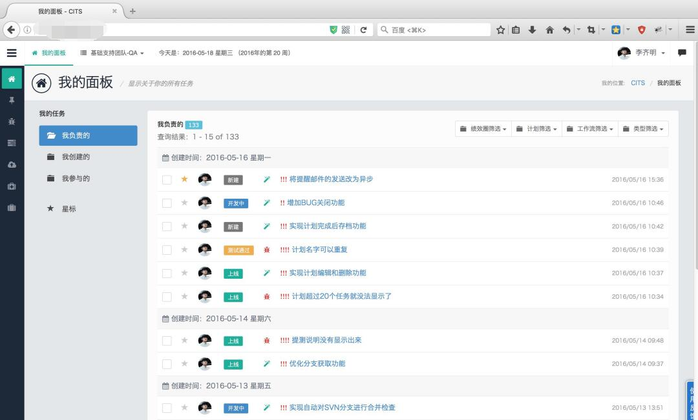

# CITS介绍

CITS(Chocolate Issue Tracker System)巧克力任务跟踪系统。是一个集『需求管理』，『任务/BUG跟踪』，『代码部署』，『过程数据分析』为主的集成化协作工具。

系统可以满足产品经理，开发和测试团队的协作需求。项目经理可以根据三种角色产生的过程数据形成的图表来优化整个项目团队。

产品经理能做什么

1. 创建计划。根据产品迭代的周期制定详细的需求开发和维护需求；
2. 跟踪任务。通过CITS可以对计划中任务的处理进度实时跟踪；

开发人员能做什么

1. 创建/受理任务。受理产品经理计划中的任务，也可以自发的创建代码重构任务；
2. 跟踪测试。任务开发完毕后指派给测试人员，跟踪测试进展；

测试人员能做什么

1. 受理测试任务。从任务加入计划后就可以对任务进行跟踪，提前做好测试用例；
2. 部署提测代码。一键将提测代码进行合并，并部署到测试环境；

另外：

1. 过程数据分析。三种角色均可以通过数据分析功能获得一定时间内的数据报表，为进一步工作和协作流程优化提供数据支撑；
2. 一键部署代码。系统支持一键部署代码到线上生产环境，这个操作可以是测试人员来完成也可以是开发人员来做。

# 为什么要开发CITS

####需求的产生

CITS是从2015年12月份开始开发的。那么为什么要开发CITS呢？其实是基于以下几点需求：

1. 开发者提测的代码没有办法与任务关联起来，让测试人员如何下手呢？
2. 经常有人在RTX问：我的代码现在是在哪个阶段了？
3. 测试的代码有没有问题？发布了我怎么不知道？我需要反复的问测试人员。

**CITS正是为了解决上述需求而诞生的**

> 沟通不畅造成的效率低下，人力成本上升是企业发展的障碍之一。仅仅从制度上来约束是远远不够的，引入或开发符合团队需求的协作工具才是解决问题的钥匙。
> 
> ——江边望海

####功能开发

**ver_0.1.0的功能：**

1. **RTX弹窗提醒：**研发人员提交代码给测试人员，测试人员会收到RTX提醒，及时认领你的提测；
2. **自动合并SVN分支代码：**测试人员需要合并代码（以前手动合并，现在集成到CITS里面了）测试人员不需要登录服务器就能合并svn代码
3. **一键部署提测代码：**测试人员合并代码后将代码发布到测试环境进行测试，通过后通知研发人员
4. **上线通知功能：**测试人员上线测试通过的代码，上线成功后通过RTX提醒通知研发人员

CITS降低了SVN合并发布的时间成本，将原来手动需要5分钟部署的操作缩短到5分钟。

# 什么是以人为本的软件开发思想

大多数的软件是通过规则去限制使用者的范围，也就是在用设限的方式实现管理和协作的目的。这种设计思想是一种中心化的设计思想。

CITS设计之初就明确了『以人为本』的思路。在江边望海看来，人类是自由的，协作是自然发生的，不存在谁管理谁的概念。让自然法则成为协作的法则，那么怎么去理解呢。

当一个人有一个想法做一件事情的时候，他需要考虑怎么做，如何做。将未来的目标通过拆解成具体的任务落地，然后找到适合的任务执行人去执行。他的目标是否能完成在于他是否

1. 将目标拆解到可以落地，被具体的人执行；
2. 他需要给协作人讲明白，用协作人能够听得懂的可以理解的语言；
3. 能够使用工具记录协作数据进而优化协作过程中的问题；

所以，诸如：需求的讲解，任务的拆解如果按照中心化的思想很容易造成，用行政命令强制让任务执行人为目标人的能力缺陷买单，进而会损伤整个团队的协作效率。

借用supercell创始人的理念，每个cell都是独立的他们需要为他们的想法负责，让市场去验证每个cell有没有存在的价值，这其实就是一种自然法则的协作方式，从达尔文进化学的角度看是最优。

